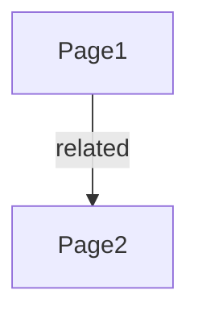

# Creating Mermaid Diagrams

Add diagrams to visualize relationships.

Example:

Include in notes and export for rendering in MkDocs.

@doc [MermaidDiagrams] category: "Tutorial"; author: [PluginAuthor]; created: "2025-07-14".