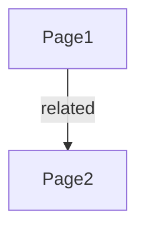

# Page 1

## RDF Data
[Alice] knows [Bob]; name: "Alice Smith".
@doc [Page1] category: "Tutorial"; author: [Alice]; related: [Page2]; created: "2025-07-14".

## Diagram

```mermaid
graph TD;
  A[Page1] -->|related| B[Page2];
```